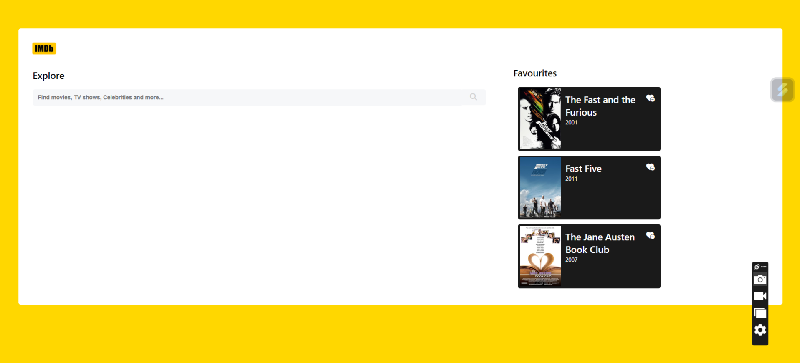
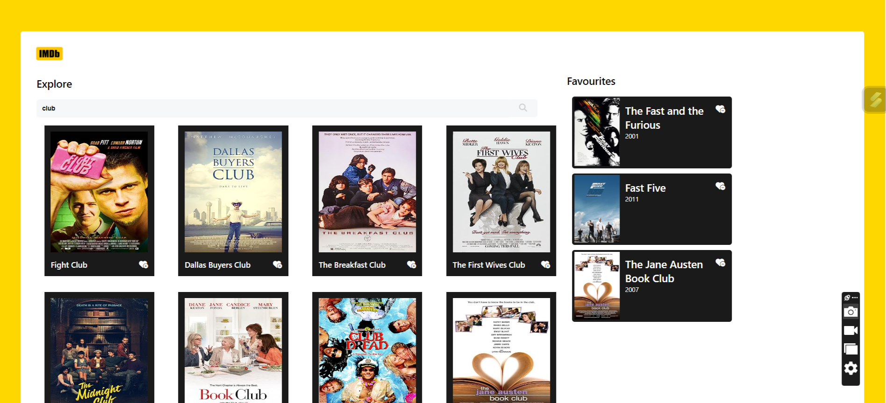
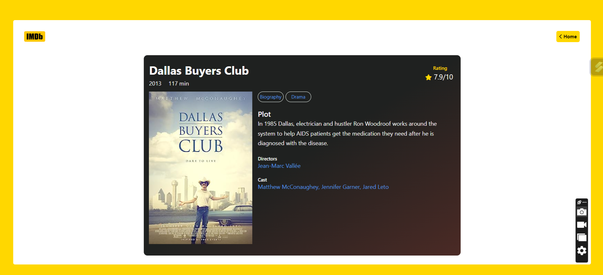

# IMDB-clone
IMDB clone application developed as part of the coding ninjas frontend skill test. The application hosts a number of features including search and populate, add/remove favourites and click to know more about movies.

The code is structured into functions to promote modularity and code readability.

The code demonstrates the use of asynchronous operations for API calls and localStorage for data persistence.

## Features
- Fetch and Populate search results as the characters are typed
- Click on the heart icon to save movie to favourite section
- Loading Favourite movies on page refresh
- Alerts to inform user about movies already existing in the favourites list
- Click on the movie poster to navigate into a detailed view about the movie
- Click on the heart minus icon to remove item from the Favourites list

## Tech used
- HTML
- JavaScript
- CSS
- OMDB API
- FontAwesome Icons

### Hosted link: [IMDB-clone](https://mouup.github.io/IMDB-clone/)

